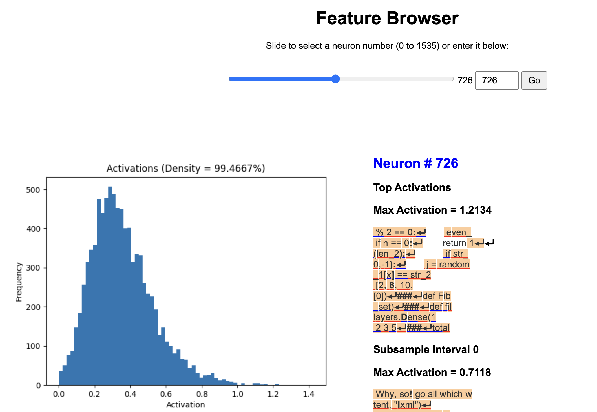
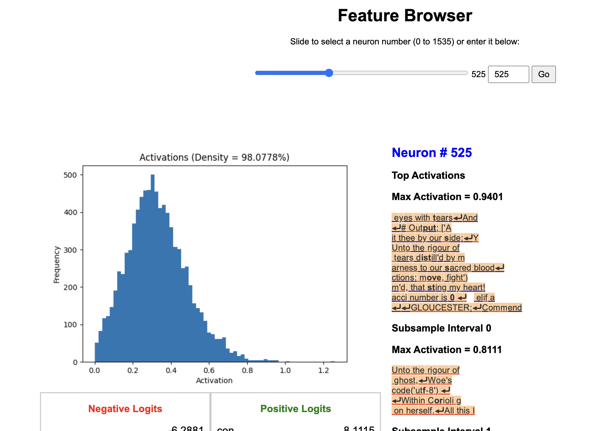

# Towards Monosemanticity: Decomposing Language Models With Dictionary Learning _(on your laptop! in 10 minutes or less!)_

Hello! You are probably aware of this [very cool research from Anthropic](https://transformer-circuits.pub/2023/monosemantic-features/index.html)
where they train an autoencoder to interpret the inner workings of a transformer.

(If you are not aware, feel free to read it, it's quite fascinating)

I was curious how this technique scales when you don't use very much data or compute. Does it still work?
At all?

So, I forked this lovely repo from @shehper (thank you shehper!), and made some modifications.
As shehper notes in their original README, their results are excellent, but the code is a bit rough.

I cleaned up a code a bit, but since I don't have any GPUs, my results are worse. I still had a good time
and found it interesting. If you'd like to reproduce my results in a few minutes on your
(hopefully new-ish Apple Silicon) laptop, read on!

## Reproduction Instructions (+ commentary)

First, clone the repo. Then, run:

```
cd transformer/data/shakespeare_char
python prepare.py
```

This saves the encoded version of the dataset to disk, and trains a tokenizer.

_What? Training a tokenizer?_

That's right, reader -- we're adding additional complexity with dubious benefit, right out of the gate.

I didn't want to use the full gpt-2 vocabulary (trying to keep the model small), so I just used the
famous shakespeare_char dataset, which tokenizes per character and has a vocab size less than 100.

Initial results with this were poor, and I wasn't able to derive any sort of clear link
between specific neuron activations and semantic content understanding.
I hypothesized that was partly due to the tokenization, so I added a custom tokenizer
with a vocabulary of 1024.

This tokenizer was trained on a custom dataset of 1M characters of shakespeare_char and 1M characters
of a Python dataset I found on HuggingFace. This is a notable detail: because of the low compute +
low data regime I'm working in, my idea was to train a model on a relatively bi-modal dataset, and see
if the neurons would nicely fall into two categories, either a "Shakespeare Neuron" or a "Python Neuron".
(Spoiler: they kinda did!)

For context, the Anthropic paper has some great details on their training regime -- they train their
tiny transformer on 100B tokens, and their autoencoder on 8B activation vectors. I am obviously quite a
few orders of magnitude below that, sadly.

Okay, now that your dataset and tokenizer is ready to go, let's train some models!

```
# need MPS_FALLBACK because nn.Dropout isn't supported, :(

# in the transformer/ directory
PYTORCH_ENABLE_MPS_FALLBACK=1 python train_transformer.py \
  config/train_shakespeare_char.py \
  --device=mps \
  --max_iters=7500 \
  --lr_decay_iters=7500 \
  --n_embd=192 \
  --out_dir=0730-shakespeare-python-custom-tok \
  --batch_size=24 \
  --compile=True
```

Here we train our tiny transformer. This is all ripped out of minGPT, thanks Karpathy!
This takes 5 minutes or so on my MacBook. There a lot of hyperparams there that are ripe for tuning.

Once it's trained, it's good to check if it actually produces sensible outputs.

```
# in the autoencoder/ directory
python generate_tokens.py \
  --prompt 'def run' \ # or 'oh romeo'
  --gpt_ckpt_dir=0730-shakespeare-python-custom-tok
```

When I run this, I get:

```
oh romeo!

First Servingman:
Yecond Servingman:
What, had, are in Pomprecy thyself.

First Servingman:
Good lady?
First Servingman:
Spirrairint sir:
Thour, sir, thou art 'tis
```

and:

```
def run_path( artist):
 app.0
  sum = 0
  sum += generate_cart = 0
 sum(input("Facters)
print(result)
###
"""
def num_sum(ates, b):
  sum = 0
  a = 0
  while b < 0:
   sum += sum1
  while 1:
   min = b
  for print(sum + min(num) + b += 1
  else
```

Which, hey, not too bad for a few minutes of local training! Vaguely reasonable Python and Shakespeare.

Now, it's time to train the autoencoder. First, prepare the dataset:

```
python prepare_autoencoder_dataset.py \
  --num_contexts=7500 \
  --num_sampled_tokens=200 \
  --dataset=shakespeare_char \
  --gpt_ckpt_dir=0730-shakespeare-python-custom-tok
```

This runs a bunch of forward passes on the trained transformer, and saves them to disk as `.pt` files for later training.
This is done as a memory optimization, and arguably isn't needed at small scale training. The 7500 contexts is tuned such that it covers
the entirety of the dataset that we saved to disk the previous `prepare.py` script. The Anthropic paper mentions that they see best results
training the autoencoder without data re-sampling  (aka, not repeating data), so we follow that here.

Let's train the autoencoder:

```
python train_autoencoder.py \
  --device=mps \
  --l1_coeff=3e-7 \
  --learning_rate=3e-4 \
  --gpt_ckpt_dir=0730-shakespeare-python-custom-tok \
  --dataset=shakespeare_char \
  --batch_size=2048 \
  --resampling_interval=500 \
  --resampling_data_size=100 \
  --save_interval=1000 \
  --n_features=1536
```

Anthropic's paper discusses a concept of "neuron resampling", where they revive dead neurons during training. Among other factors, a cause
of dead neurons is training too long. Since I'm training for a very short period of time, I don't see any dead neurons, and that functionality
wasn't needed -- but if you'd like to train longer, you should be aware of this.

Also, notice the `n_features=1536` -- this is a 2x multiple autoencoder. Not that the embedding dimension of the transformer we trained is 192.
Since we're plucking the features from inside the MLP, which has is projected into 4x the embedding dimension (aka 768), and 1536 is twice that.

Anthropic mentions they train a family of models with multiples from 1x to 256x. For a low-compute reproduce, 2x seemed to work well. I tried
a few other multiples and didn't see significant difference.

Note that training the autoencoder is quite fast. This is probably the weakest point of the pipeline, and more data would probably help. An
obvious TODO would be to scale this up to ~1 hour of training or so, and see how things change.

Once this is done, it's time to actually inspect the features, by running repeated forward passes with certain neurons suppressed.

```
python build_website.py \
  --device=mps \
  --dataset=shakespeare_char \
  --gpt_ckpt_dir=0730-shakespeare-python-custom-tok \
  --sae_ckpt_dir=2024-07-31-0936 \
  --num_contexts=100 \
  --num_phases=96
```

## Results

We do see some differentiation between neurons! But, not a tremendous amount. The activations don't follow a nice power law as one might
hope. I hypothesize this is due to lack of data.

My hope was that there would be clearly delineated "Python" vs "Shakespeare" neurons. This happened a bit, but not as much as I would have liked.
One obvious thing to try would be train on multiple character sets, for example English and Japanese. This would create differences at the token
level, that might allow for a more clear fragmentation of the internals.

Plenty of Neurons seem to be "majority Python", but few neurons seem to be "majority Shakespeare".

Here's an example of a Python neuron:

<p align="center">
  
</p>

And here's an example of a (rare) Shakespeare neuron:

<p align="center">
  
</p>

## Future Work

I'm really interested in the intersection of "low compute / efficient training" + "model interpretability". Anthropic mentions the challenges
of scaling this approach up to large models in their paper, and they mention it more in their successful extraction of Claude 3 Sonnet
features paper.

As models continue to get bigger, and open source continues to try to catch up, it seems valuable to have well established
off-the-shelf techniques to decompose and interpret the inner workings of a transformer. Among other things, the steerability and application
benefits are significant. The golden gate bridge feature demo was a fun example, but the tactical benefits and possibilities make the
concept of a system prompt seem somewhat antiquated.